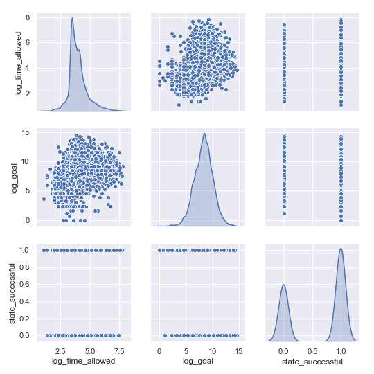

# Kickstarter_project

The aim of this project is to build a Classification Model to predict whether or not a new project on Kickstarter will likely succeed or fail.

## Data Source
Data was obtained from:

https://webrobots.io/kickstarter-datasets/

A total of 9338 points. Aim to keep 5000 or more (duplicates, Nans, etc...). The Kickstarter project categories were a mix and years ranged from 2008-2019.

## Features
The final features chosen were:
- category: Film, Music, Fashion etc..
- location: country and state converted to continents to balance data
- created_at: data of starting the campaign
- deadline: deadline set for achieving the desired
- name: projects name
- staff_pick: projects highlighted on homepage
- goal: desired amount of money to succeed amount of money
The rest were eliminated due to repetation, high NAN numbers, potential of data leakage and based on domain knowledge and logic.

Out of the aforementioned features the following were engineered:
- Continuous Features:
    - Log of time allowed (deadline-created_at) and Log of 'goal'
    - Data was filtered so that time allowed is less than 5000 days and goal less than 2 million USD.
- Categorical Features:
    - 'category', 'staff_pick', 'country' were all converted to dummies

## Target
The target was 'state' which shows whether the project was  successful, failed, suspended, live, or cancelled. The live, cancelled and suspended states were eliminated as it was difficult to determine the reason for for cancellation/suspension and live projects have no outcome yet.

## Modelling
The following models were run:
- Baseline model of dummyclassifier used which gave 63% accuracy
- Random Forest with hyperparameter tuning using iterations and AUC vs Parameter range plots

- Logistic Regression with hyperparameter tuning in solver type, C parameter and penalty
- XGBoost with and without Gridsearch.
- All models were validated first with training data and then tested with the testing data.

**Logistic Regression with l1 penalty, bilinear solver gave the best results for accuracy and precision.**

The following is a summary of accuracy, recall, percision and f1 socres of the top four models:

|Model                   |Accuracy        |Recall          |Precision       |F1              |
|------------------------|----------------|----------------|----------------|----------------|
|Random Forest Tuned     |77.2%           |85.9%           |79.5%           |82.6%           |
|LogReg                  |79.6%           |82.2%           |84.5%           |83.3%           |
|**LogReg Tuned**        |**80.0%**       |**82.0%**       |**85.2%**       |**83.6%**       |
|XGBoost with GridSearch |78.4%           |88.0%           |79.5%           |83.5%           |

## Further Imporvements
The following can be used to improve on the model:

- Quantify quality of the project’s presentation through recognising the use of videos, images and rewards.
- Monitor updates from project founders and number of backers/amount of pledges for first 10-20 days and quantify it as a feature.
- Work on better classifying project categories and make them more uniform
